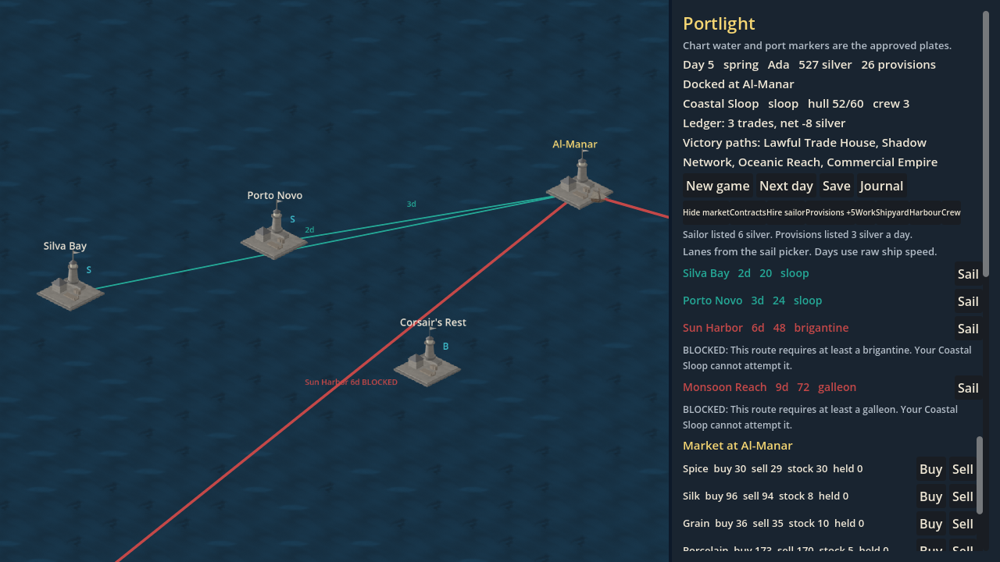
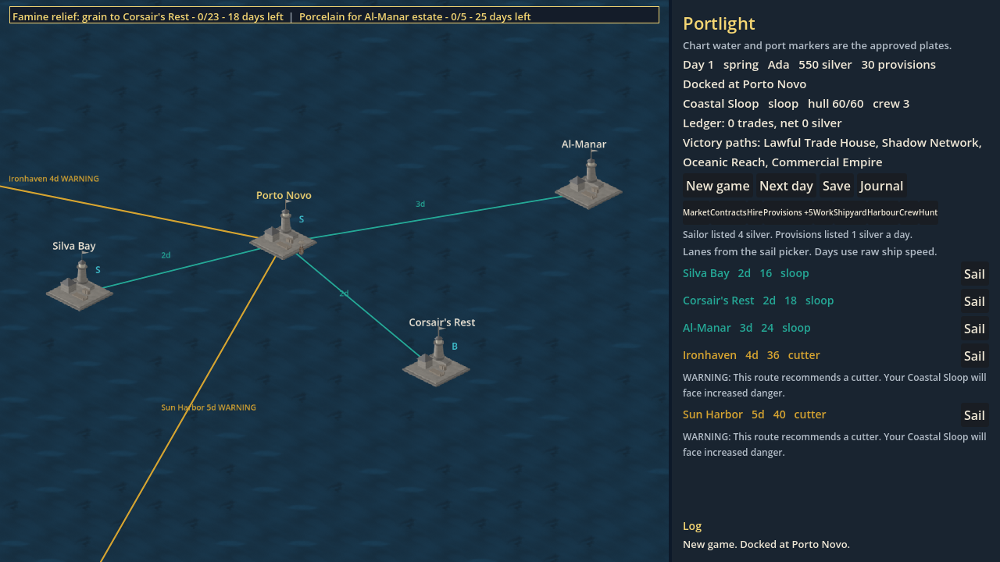

<p align="center">
  
</p>

<p align="center">
  <a href="https://github.com/mcp-tool-shop-org/portlight-bounty/actions/workflows/ci.yml"></a>
  <a href="https://codecov.io/gh/mcp-tool-shop-org/portlight-bounty"></a>
  <a href="LICENSE"></a>
  <a href="https://mcp-tool-shop-org.github.io/portlight-bounty/"></a>
</p>

Portlight Bounty is a trade game. You buy, you sail, you take a contract, and you try not to arrive broke. The line under the mark is the whole pitch: trade, sail, prosper.

This repository is the Rust port of [Portlight](https://github.com/mcp-tool-shop-org/portlight). The simulation is the rules. The Godot 4.7 chart is the game you play. Version 0.1.0 is the first GitHub release of that pair.

The docked chart, with the market open at Al-Manar:



Two live contracts on the strip. The numbers are cargo delivered, cargo owed, and days left:



## Play

You need Rust 1.98.1 (the pin in `rust-toolchain.toml`) and Godot 4.7.2, the official build. Linux CI uses that pair. A Windows build of the extension has been run. A macOS build has not.

```
cargo build -p portlight-godot
godot --path godot
```

New game, then The Merchant, and leave the name as Ada if you want the voyage the screenshots show. Sail, trade, and take a contract from the port row. Save writes a version-12 slot beside New game. A loaded custom captain keeps the name, the silver, and the day. The custom template itself is not in the save, so prices after a load are the merchant's. That matches the Python game.

At sea the port row hides. Next day advances the voyage. The day's report opens over the chart when the day has something to say.

The handbook walks the screens: [landing page](https://mcp-tool-shop-org.github.io/portlight-bounty/), then Handbook.

## The simulation

The crates do not draw. `portlight-sim` is the rules. `portlight-cli` runs a script and prints the snapshot the parity harness compares to Python. `portlight-chart` is the dimetric math, still with no Godot in it.

```
cargo run -p portlight-cli -- new --captain merchant --name Ada --seed 42
cargo run -p portlight-cli -- --help
cargo test --locked --workspace --exclude portlight-godot
```

`portlight --help` lists every script command. Exit codes are 0 when the run worked, 1 when the simulation or a file failed, and 2 when the command was not understood. Failures are sentences. There is no telemetry and no `--debug` switch.

The Python game at commit `9b02494` is the source of the rules. A number both sides agree on stays, including the ones that look odd. The handbook names them.

## What 0.1.0 is

A playable Mediterranean chart: ports, lanes, market, contracts, crew, the yard, the harbour desk, hunt, the journal, and a fight at sea. The landing bundle is manifest 0.4.3. `godot/assets/landing/MANIFEST.json` is the list of plates. An older note that said "70 PNGs, v0.3.0" is out of date.

Draft pull requests for extra fight and contract lines are not in this tag.

## Pictures

The MIT license covers the code. It does not cover the pictures under `godot/assets/` or `docs/screenshots/`. You can look at them here. You cannot take them for another project. No art license is offered.

The five deck props (barrel, bollard, cart, crate, torch) are Blender EEVEE plates that were vendored in. The record does not say who modeled them. The three quay flags were painted on a local ComfyUI setup (a Qwen Image weight and the Salt Road LoRA) and then retoned with a fixed color map. They were not a Comfy Cloud job. Generator account terms bind the account that made a file. They do not make the file free for anyone else.

There is no ElevenLabs voice in this release.

## Trust

The game is local. It does not open a network connection, it does not have an account, and it does not send telemetry. It reads the catalog baked into the binary, a script you name, and a save you name. It writes a version-12 save into a folder you choose. The chart's default folder is `saves/` under the working directory.

Report a vulnerability in private on this repository. See [SECURITY.md](SECURITY.md). There is no separate mailbox.

## Support

0.1.0 is the supported release. Issues and pull requests are welcome. Read [CONTRIBUTING.md](CONTRIBUTING.md) before you send one. The code is MIT. The pictures are not.

Built by [MCP Tool Shop](https://mcp-tool-shop.github.io/). Code and art: mcp-tool-shop contributors.
